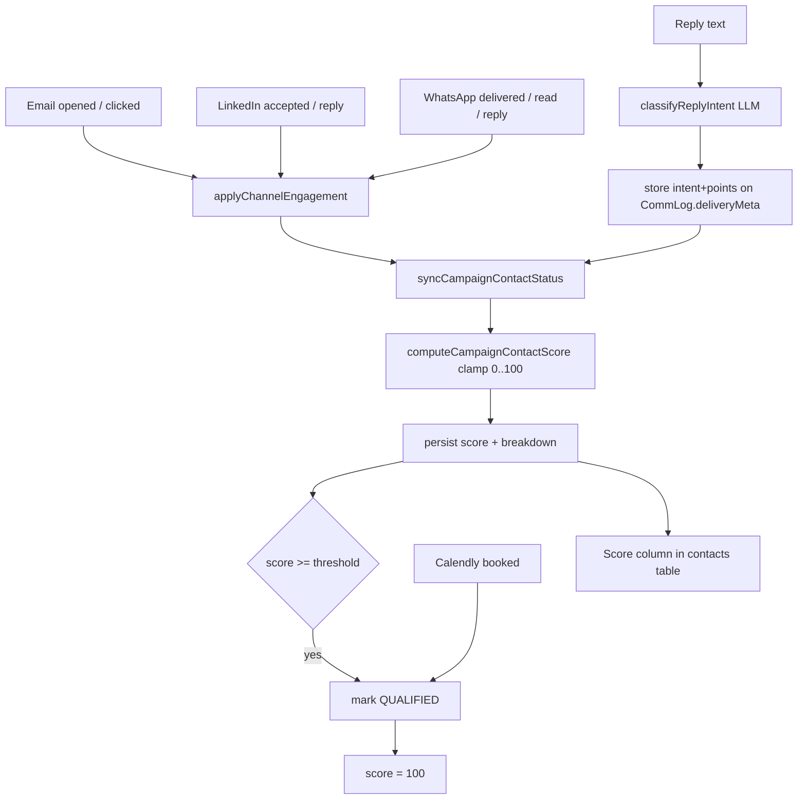

## 1. Replace `ContactCampaign` with a new `CampaignContact` model (full rename, data loss OK)

Goal: a clean `CampaignContact` model that fully replaces `ContactCampaign` everywhere — model, DB table, enum, FK column, relation fields, accessors, and internal helper files/functions. Migration renames the table/enum/column (data loss is acceptable per your call).

In [prisma/schema.prisma](prisma/schema.prisma):
- `model ContactCampaign` -> `model CampaignContact` (table renamed, no `@@map`).
- `enum ContactCampaignStatus` -> `enum CampaignContactStatus`; update the `status` field type.
- Relation fields renamed: `Campaign.contactCampaigns` / `Contact.contactCampaigns` -> `campaignContacts`; `CommunicationLog.contactCampaign` -> `campaignContact` and scalar FK `contactCampaignId` -> `campaignContactId` (with its `@@index`es).

Code changes across the referencing files:
- Prisma accessor `prisma.contactCampaign` / `tx.contactCampaign` / `prismaClient.contactCampaign` -> `*.campaignContact` (~21 files).
- Relation includes/accesses `contactCampaigns` -> `campaignContacts`, `contactCampaign` -> `campaignContact`.
- Scalar FK `log.contactCampaignId` -> `log.campaignContactId` (and `select`/`where`/`data` keys).
- Internal helper files/functions/constants renamed for consistency:
  - `src/lib/syncContactCampaignStatus.js` -> `src/lib/syncCampaignContactStatus.js` (`syncContactCampaignStatus` -> `syncCampaignContactStatus`, `deriveContactCampaignStatus` -> `deriveCampaignContactStatus`, `reconcileContactCampaignStatusesForCampaign` -> `reconcileCampaignContactStatusesForCampaign`, etc.)
  - `src/lib/contactCampaignStatus.js` -> `src/lib/campaignContactStatus.js` (`CONTACT_CAMPAIGN_STATUS_*` -> `CAMPAIGN_CONTACT_STATUS_*`, `TERMINAL_CONTACT_CAMPAIGN_STATUSES` -> `TERMINAL_CAMPAIGN_CONTACT_STATUSES`)
  - `flattenContactCampaign` -> `flattenCampaignContact`, `enrollContactInCampaign` unchanged, `markContactCampaignQualified` -> `markCampaignContactQualified`, `evaluateContactCampaignQualification` -> `evaluateCampaignContactQualification`, `contactCampaignInclude` -> `campaignContactInclude`, `serializeContactCampaignRows` -> `serializeCampaignContactRows`.
- Keep existing deprecated `*Prospect*` aliases working (they re-export the renamed functions).

Notes:
- API route folder/param names (e.g. `/api/campaigns/[id]/contact-campaigns/[contactCampaignId]`) and the `prospectId`/`prospects` response aliases are left unchanged to avoid breaking the frontend fetch paths and external API consumers. Only the model/DB/internal identifiers are renamed.
- Migration: a single rename migration — `ALTER TABLE "ContactCampaign" RENAME TO "CampaignContact"`, `ALTER TYPE "ContactCampaignStatus" RENAME TO "CampaignContactStatus"`, `ALTER TABLE "CommunicationLog" RENAME COLUMN "contactCampaignId" TO "campaignContactId"`, plus rename the related indexes/FK constraint. (Editing the Prisma-generated migration to use RENAME preserves data; if regenerated fresh it would drop/recreate, which is also acceptable here.)

## 2. Schema additions for scoring

In [prisma/schema.prisma](prisma/schema.prisma):
- `CampaignContact`: add `score Int @default(0)`, `scoreUpdatedAt DateTime?`, `scoreBreakdown Json?`.
- `Campaign`: add `qualificationThreshold Int @default(90)` (dynamic per-campaign threshold).

Migration: same rename migration adds `ALTER TABLE "CampaignContact" ADD COLUMN "score" ...`, `"scoreUpdatedAt"`, `"scoreBreakdown"`, and `ALTER TABLE "Campaign" ADD COLUMN "qualificationThreshold" ...`. Run `npx prisma migrate dev` + `prisma generate`.

## 3. Scoring engine (new)

New `src/lib/scoring/campaignContactScore.js`:
- Weight table (clamped, final score `0..100`):
  - email opened / WhatsApp read: +10
  - CTA/link clicked (`ctaClickedAt`): +15
  - LinkedIn connection accepted (`responseType === "connected"`): +20
  - WhatsApp delivered: +5
  - reply: points come from stored intent on the log (positive +45, neutral/question +15, negative -30)
  - Calendly booked / qualified: score forced to 100
- `computeCampaignContactScore({ campaignContact, commLogs })` -> `{ score, breakdown, qualifiedByScore }`. Deterministic recompute from comm logs (idempotent, no double counting). Reads per-reply intent from `log.deliveryMeta.replyIntent`/`replyScore`.
- Export `MAX_SCORE = 100`, default `SCORE_THRESHOLD = 90`.

New `src/lib/scoring/replyIntent.js`:
- `classifyReplyIntent({ text, channel, campaign })` -> `{ intent: "positive"|"neutral"|"negative", points, reason }` using the same OpenAI JSON-schema pattern already in [src/lib/execution/qualifyContact.js](src/lib/execution/qualifyContact.js). This is the "intelligent" part: it infers what the reply actually means so a negative reply does not add points (and can subtract / disqualify).

## 4. Wire scoring into the existing engagement chokepoint

All channel webhooks/sends already funnel through `syncCampaignContactStatus` ([applyChannelEngagement.js](src/lib/execution/applyChannelEngagement.js), [webhookTracking.js](src/lib/execution/webhookTracking.js), [manualCopilotSend.js](src/lib/execution/manualCopilotSend.js)). So:

- In `src/lib/syncCampaignContactStatus.js` (renamed): after status derivation, call `computeCampaignContactScore`, persist `score/scoreUpdatedAt/scoreBreakdown`, and if `score >= campaign.qualificationThreshold`, mark qualified (reason `score_threshold`). Fetch `campaign.qualificationThreshold` in the existing query.
- In [src/lib/execution/qualifyContact.js](src/lib/execution/qualifyContact.js): in `evaluateCampaignContactQualification`, run `classifyReplyIntent` on the latest reply, persist the intent + points onto that reply's `CommunicationLog.deliveryMeta` (so the deterministic recompute reads it), keep disqualify-on-negative, then recompute score. Replies arriving before classification score as neutral until `runPostTrackQualification` (already triggered on reply via `triggerReplyExecution`) classifies them.
- In `markCampaignContactQualified`: set `score: 100` when qualifying (covers Calendly booked / tracked-link in [handleCalendlyWebhook.js](src/lib/execution/handleCalendlyWebhook.js) and [book/route.js](src/app/api/campaigns/[id]/book/route.js)).

## 5. Expose + display score

- [src/lib/resolveBusinessUser.js](src/lib/resolveBusinessUser.js) `flattenCampaignContact`: add `score`, `scoreBreakdown`.
- [src/lib/campaignDetail.js](src/lib/campaignDetail.js) `serializeCampaignContactRows`: add `score`, `scoreThreshold` (from `campaign.qualificationThreshold`), `scoreBreakdown` to each row.
- [src/app/campaigns/[id]/page.js](src/app/campaigns/[id]/page.js): add a "Score" column to the contacts table (`score/100` with a small bar; qualified styling when `score >= threshold`) and show the score + breakdown in the contact drawer.

## Data / scoring flow

## Defaults chosen (adjustable)
- Rename depth: full rename - model, DB table, enum, FK column (`campaignContactId`), relation fields, accessors, and internal helper files/functions all renamed; `ContactCampaign` removed. API route URL paths and `prospect*` response aliases kept to avoid frontend/external breakage.
- Weights as in section 3; threshold 90 (per-campaign configurable via `qualificationThreshold`); max score 100 (per your instruction).