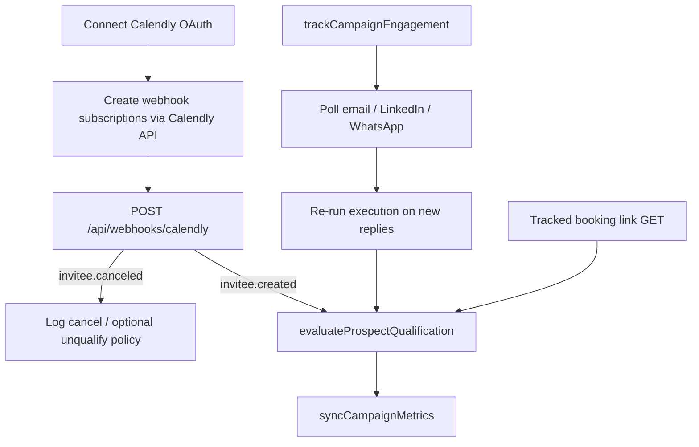

# Qualification, reply channel priority, and comm logs drawer

## Current gaps

| Area | Today | Target |
|------|--------|--------|
| Qualified metric | [`computeCampaignMetrics`](src/lib/campaignMetrics.js) sets `qualifiedLeads = repliedProspectIds.size` | Count prospects with `qualifiedAt` set |
| Prospect state | No `qualified` fields on [`Prospect`](prisma/schema.prisma) | `qualifiedAt`, `qualifiedReason` |
| Calendly | Not implemented | OAuth connect (tenant) + API webhooks + campaign booking URL + tracked link |
| Reply follow-up channel | LLM-only; can pick LinkedIn when WhatsApp replied | **Code-enforced** same channel as latest reply |
| Comm logs UI | Per-prospect thread in drawer; limited fields | Campaign-wide drawer, newest-first, full metadata |



---

## 1. Qualified lead model and rules

### Schema migration

Add to **Campaign**:
- `calendlyBookingUrl String?` — user-facing Calendly scheduling URL

Add to **Prospect**:
- `qualifiedAt DateTime?`
- `qualifiedReason String?` — enum-like values: `calendly_booked`, `calendly_link_clicked`, `positive_reply`, `manual` (future)

Update [`docs/execution-layer-rules.md`](docs/execution-layer-rules.md) §12 (remove “not fully automated”) and add **§14 Qualified leads**.

### Qualification triggers

| Trigger | When | Action |
|---------|------|--------|
| **Calendly booked** | OAuth webhook `invitee.created` ([Calendly docs](https://developer.calendly.com/trigger-automations-with-other-apps-when-invitees-schedule-or-cancel-events)) | Match invitee email → prospect(s) for tenant → set `calendly_booked` |
| **Link clicked** | GET tracked redirect (see below) | Set `qualifiedReason: calendly_link_clicked` (user chose both open + book) |
| **Positive reply** | After each **track** run completes | LLM classifies latest unreplied inbound text; if qualified intent → set `positive_reply` |

**Not qualified:** generic replies, OOO, “not interested”, questions without booking intent.

### New module: [`src/lib/execution/qualifyProspect.js`](src/lib/execution/qualifyProspect.js)

- `markProspectQualified(prisma, { prospectId, campaignId, reason, sourceMeta })` — idempotent (no-op if already qualified)
- `evaluateProspectQualification({ prospect, commHistory, campaign })`:
  - Skip if `prospect.qualifiedAt`
  - Use `getLatestProspectReply(commHistory)` from [`humanizeOutboundMessage.js`](src/lib/execution/humanizeOutboundMessage.js)
  - Small structured OpenAI call (cheap model): `{ qualified: boolean, reason: string, confidence: "high"|"medium" }` with examples: demo booked, “let’s talk Thursday”, “send contract” = yes; “unsubscribe”, “wrong person” = no
  - Only auto-qualify on `high` or explicit keyword guardrails for “call scheduled” / “deal” phrases as backup

### Hook points

1. **End of [`trackCampaignEngagement`](src/lib/execution/trackCampaignEngagement.js)** — after reply reruns, for each prospect with `activity === "reply"` in this pass (or all prospects with `responseType` and `!qualifiedAt`), run `evaluateProspectQualification`, then `syncCampaignMetrics`.
2. **Calendly webhook** — tenant-scoped handler after OAuth subscription (below).
3. **Tracked link** — new route (below).

**Calendly cancel:** On `invitee.canceled`, log the event on the prospect/comm log; do **not** remove `qualifiedAt` if `rescheduled === true` (reschedule fires both canceled + created per Calendly). Only clear qualification on explicit cancel without reschedule if product later requires it — default v1: keep qualified once booked.

### Stop outreach when qualified

In [`runCampaignExecution.js`](src/lib/execution/runCampaignExecution.js), before `decideNextActionForProspect`:

```js
if (prospect.qualifiedAt) {
  // create skipped comm log: "Prospect qualified — outreach stopped"
  continue;
}
```

Include `qualifiedAt` / `qualifiedReason` in [`campaignDetail.js`](src/lib/campaignDetail.js) prospect serialization and show **Qualified** badge in prospect table + drawer on [`page.js`](src/app/campaigns/[id]/page.js).

### Metrics

[`computeCampaignMetrics`](src/lib/campaignMetrics.js):

```js
qualifiedLeads: prospects.filter(p => p.qualifiedAt).length
// requires passing prospect rows or a count query in syncCampaignMetrics
```

Change `syncCampaignMetrics` to count `prospect.count({ where: { campaignId, qualifiedAt: { not: null } } })` instead of inferring from replies.

---

## 2. Calendly: OAuth connect + webhooks + campaign booking URL

Reference: [Trigger automation when invitees schedule or cancel](https://developer.calendly.com/trigger-automations-with-other-apps-when-invitees-schedule-or-cancel-events) — `invitee.created` on book, `invitee.canceled` on cancel; reschedule sends **both**.

### 2a. Tenant integration — Calendly Developer Platform OAuth

Mirror existing integration pattern ([`EmailIntegration`](prisma/schema.prisma), [`WhatsAppIntegration`](prisma/schema.prisma)) with a new **`CalendlyIntegration`** model:

| Field | Purpose |
|-------|---------|
| `userId` (unique) | Tenant owner |
| `encryptedAccessToken` | OAuth access token (AES-256-GCM, same `SECRET` pattern as Smartlead/Linkup) |
| `refreshToken` (encrypted) | For token refresh / rotation |
| `organizationUri` | Calendly organization URI from `/users/me` |
| `userUri` | Calendly user URI |
| `ownerEmail` | Display / debugging |
| `status` | `pending` \| `connected` \| `error` |
| `webhookSubscriptionUri` | Stored subscription resource URI(s) or JSON array of subscription ids |
| `connectedAt` | Timestamp |

**Env (document in `.env.example`):**
- `CALENDLY_CLIENT_ID`, `CALENDLY_CLIENT_SECRET`
- `CALENDLY_REDIRECT_URI` → `{APP_URL}/api/integrations/calendly/oauth/callback`
- `CALENDLY_WEBHOOK_SIGNING_KEY` — signing key from Calendly webhook subscription (or app-level key per Calendly docs)

**OAuth flow (Settings UI):**

1. User clicks **“Connect Calendly”** (new section in Settings alongside Email / LinkedIn / WhatsApp).
2. `GET /api/integrations/calendly/oauth/start` — build authorize URL (Calendly Developer Platform OAuth), `state` = signed session nonce tied to `userId`.
3. User approves in Calendly.
4. `GET /api/integrations/calendly/oauth/callback` — exchange code for tokens; call Calendly API `GET /users/me` → persist `organizationUri`, `userUri`, encrypted tokens.
5. **Subscribe to webhooks programmatically** (Calendly API “Create a Webhook Subscription”):
   - `url`: `{APP_URL}/api/webhooks/calendly` (single tenant endpoint; identify tenant via `organization` / `user` URI in payload or lookup by stored subscription)
   - `events`: `invitee.created`, `invitee.canceled`
   - `scope`: `organization` (preferred) or `user` matching stored URI
   - Store returned subscription URI(s) on `CalendlyIntegration`
6. On disconnect / reconnect: delete old subscriptions via API before creating new ones (avoid duplicates).

**New lib:** [`src/lib/calendlyApi.js`](src/lib/calendlyApi.js) — token exchange, refresh, `createWebhookSubscription`, `deleteWebhookSubscription`, `getCurrentUser`.

**New lib:** [`src/lib/calendlyIntegration.js`](src/lib/calendlyIntegration.js) — encrypt/decrypt tokens, `upsertFromOAuth`, `serializeCalendlyIntegration`, `getCalendlyIntegration(userId)`.

**API routes:**
- [`src/app/api/integrations/calendly/route.js`](src/app/api/integrations/calendly/route.js) — `GET` status, `DELETE` disconnect
- [`src/app/api/integrations/calendly/oauth/start/route.js`](src/app/api/integrations/calendly/oauth/start/route.js)
- [`src/app/api/integrations/calendly/oauth/callback/route.js`](src/app/api/integrations/calendly/oauth/callback/route.js)

**UI:** [`src/components/settings/CalendlyIntegrationSection.js`](src/components/settings/CalendlyIntegrationSection.js) — connect / disconnect, connected account email, “Webhooks active” indicator.

**Campaign / execution guard:** If Calendly not connected, stage 2+ booking links still use `calendlyBookingUrl` but show warning on campaign page; qualification via `calendly_booked` only works when OAuth + webhooks are active.

### 2b. Campaign booking URL (per campaign)

[`NewCampaignModal.js`](src/components/campaigns/NewCampaignModal.js) step 0 — optional **Calendly booking URL** (scheduling link used in outreach; validate `https://calendly.com/...` or custom domain).

Persist in [`POST /api/campaigns`](src/app/api/campaigns/route.js).

Campaign detail ([`page.js`](src/app/campaigns/[id]/page.js)):
- Display / edit `calendlyBookingUrl` via PATCH on [`/api/campaigns/[id]`](src/app/api/campaigns/[id]/route.js)
- If tenant Calendly not connected → banner: “Connect Calendly in Settings to auto-qualify booked meetings” (no manual webhook copy-paste)

### 2c. Tracked booking link (opens)

`GET /api/campaigns/[id]/book?prospectId=...`

- Verify campaign + prospect; log click (`ctaClickedAt` or `ProspectSignal` `calendly_link_clicked`)
- `markProspectQualified(..., calendly_link_clicked)` (user chose open + book tracking)
- `302` → `campaign.calendlyBookingUrl` with UTMs (`utm_source=clarwiz&utm_campaign={id}&utm_content={prospectId}`)

### 2d. Calendly webhook handler (tenant-scoped)

New: [`src/app/api/webhooks/calendly/route.js`](src/app/api/webhooks/calendly/route.js) — **not** per-campaign id in path.

1. Verify `Calendly-Webhook-Signature` header ([webhook security](https://developer.calendly.com/api-docs)).
2. Parse payload `event`:
   - **`invitee.created`** — read invitee email, `status: active`, `canceled: false`; ignore if `canceled === true`
   - **`invitee.canceled`** — log cancel; if `rescheduled === true`, do not treat as lost lead (new `invitee.created` will follow)
3. Resolve tenant: map `payload` organization/user URI → `CalendlyIntegration` → `userId`.
4. Find prospect(s): `prospect.email` matches invitee email (case-insensitive) across **all campaigns** for that `userId` with `status` active/paused (or all non-draft).
5. `markProspectQualified(..., calendly_booked)` for each match; attach `sourceMeta` (event URI, scheduled time from payload).
6. Return `200` quickly.

Handler module: [`src/lib/execution/handleCalendlyWebhook.js`](src/lib/execution/handleCalendlyWebhook.js) — testable parsing + matching logic.

### 2e. Stage 2+ booking CTA in execution

Update [`decideNextAction.js`](src/lib/execution/decideNextAction.js) system prompt + post-process in [`src/lib/execution/appendBookingLink.js`](src/lib/execution/appendBookingLink.js) (new small helper):

- Pass `campaign.calendlyBookingUrl` and computed `nextStage` in `userPayload.tenantContext`
- Rules:
  - **Stage 1**: do not include booking/call link
  - **Stage ≥ 2** (and reply follow-ups): append tracked link `{{booking_link}}` replaced with full app URL `/api/campaigns/{id}/book?prospectId=...`
  - Prefer `ctaType: book_demo` when luring to qualification
- WhatsApp: only append link if template policy allows (text templates / session); if template-only blocks URLs, note in rules doc and keep link in email/LinkedIn only

---

## 3. Reply follow-up: same channel priority

**Root cause:** Reply mode tells the model to write a human reply but does not require `channel === latestProspectReply.channel`; [`enforceChannelRules`](src/lib/execution/executionRules.js) may remap to `prospectChannels[0]` (often email).

### Code fix (deterministic)

Add `enforceReplyChannelPriority(decision, commHistory, prospectChannels)` in [`executionRules.js`](src/lib/execution/executionRules.js):

- If `isReplyFollowUp(commHistory)`:
  - `replyChannel = getLatestProspectReply(commHistory).channel`
  - If `replyChannel` is in `prospectChannels`, set `decision.channel = replyChannel`
  - Else keep model choice (edge case: channel lost contact info)

Call after LLM parse in [`decideNextAction.js`](src/lib/execution/decideNextAction.js) (before `enforceChannelRules` or integrated into it).

### Prompt reinforcement

In `REPLY THREAD MODE` block, add:
- **MUST** reply on the same channel as `latestProspectReply.channel` unless that channel is unavailable.

### WhatsApp reply thread

When `replyChannel === "whatsapp"` and `templateId` would be forced: allow `templateId: null` only if product allows session messages; otherwise use approved template but still on WhatsApp channel (existing template fallback logic).

---

## 4. Campaign comm logs drawer (UI)

### API / serialization

Extend [`serializeCommLogForUi`](src/lib/campaignMetrics.js) (or new `serializeCommLogDetail`) with:

- `modelUsed`, `providerUsage`, `providerCost`, `deliveryProvider`, `deliveryMeta`, `deliveredAt`, `ctaClickedAt`, `templateId`, `signalRef`, `prospectName`, `prospectId`

Option A (minimal): extend existing GET [`/api/campaigns/[id]`](src/app/api/campaigns/[id]/route.js) to include `commLogs` array sorted `sentAt desc` at campaign root (not only nested under prospects).

Option B: `GET /api/campaigns/[id]/comm-logs?limit=200` for drawer refresh without full campaign payload.

Recommend **Option A** for first load + drawer uses `campaign.commLogs`; add limit cap (e.g. 200) in [`campaignDetailInclude`](src/lib/campaignDetail.js) with `orderBy: { sentAt: "desc" }`.

### UI component

New [`src/components/campaigns/CampaignCommLogsDrawer.js`](src/components/campaigns/CampaignCommLogsDrawer.js):

- Chakra `Drawer` (same pattern as prospect drawer on [`page.js`](src/app/campaigns/[id]/page.js))
- Header button: **“Activity log”** near Run next-best-action / Track engagement
- List cards (reuse styling from [`executionResultCard.js`](src/components/campaigns/executionResultCard.js)):
  - Prospect name, channel · stage, status, timestamp
  - Outbound message (+ subject)
  - `decisionReason`
  - Inbound block: `responseType`, `responseContent`, `responseAt` if present
  - Footer: model, tokens, `$total_cost_usd`, delivery status / skip reason
- Sort: already desc from API

---

## 5. Files to touch (summary)

| File | Change |
|------|--------|
| `prisma/schema.prisma` + migration | `CalendlyIntegration`; Campaign `calendlyBookingUrl`; Prospect qualification fields |
| `src/lib/calendlyApi.js` | OAuth + Calendly REST (users/me, webhook subscriptions) |
| `src/lib/calendlyIntegration.js` | Token storage, serialize, connect/disconnect |
| `src/lib/execution/handleCalendlyWebhook.js` | Parse invitee.created / invitee.canceled |
| `src/app/api/integrations/calendly/**` | OAuth start/callback, GET/DELETE integration |
| `src/app/api/webhooks/calendly/route.js` | Tenant webhook (replaces per-campaign webhook path) |
| `src/components/settings/CalendlyIntegrationSection.js` | Connect Calendly UI |
| `docs/execution-layer-rules.md` | Qualified lead + booking link + reply channel rules |
| `src/lib/execution/qualifyProspect.js` | New |
| `src/lib/execution/executionRules.js` | `enforceReplyChannelPriority` |
| `src/lib/execution/decideNextAction.js` | Booking link rules; call enforce reply channel |
| `src/lib/execution/appendBookingLink.js` | New |
| `src/lib/execution/trackCampaignEngagement.js` | Post-track qualification pass |
| `src/lib/execution/runCampaignExecution.js` | Skip qualified prospects |
| `src/lib/campaignMetrics.js` | Qualified count from DB |
| `src/lib/campaignDetail.js` | Qualification + comm logs desc + extended fields |
| `src/app/api/campaigns/route.js` | Accept `calendlyBookingUrl` |
| `src/app/api/campaigns/[id]/route.js` | PATCH `calendlyBookingUrl` |
| `src/app/api/campaigns/[id]/book/route.js` | New tracked redirect |
| `src/components/campaigns/NewCampaignModal.js` | Calendly booking URL field |
| Settings page | Mount `CalendlyIntegrationSection` |
| `src/components/campaigns/CampaignCommLogsDrawer.js` | New |
| `src/app/campaigns/[id]/page.js` | Activity button + drawer; qualified badge |

---

## 6. Test plan (manual)

1. Settings → **Connect Calendly** → OAuth completes; verify `CalendlyIntegration` connected and webhook subscriptions created (`invitee.created`, `invitee.canceled`).
2. Create campaign with Calendly booking URL.
3. Run execution stage 1 — no booking link; stage 2+ includes tracked link.
4. Open tracked link — `calendly_link_clicked`; metric increments.
5. Book meeting in Calendly as prospect email → `invitee.created` webhook → `calendly_booked`; execution skips prospect.
6. Cancel meeting (non-reschedule) → `invitee.canceled` logged; qualified status unchanged in v1.
7. Reply on WhatsApp, track, run next-best-action — outbound stays on **WhatsApp**.
8. Reply “let’s book a demo Tuesday” on email, track — `positive_reply` only when LLM confidence high.
9. Activity log drawer — newest-first with reasoning, reply, model cost.
